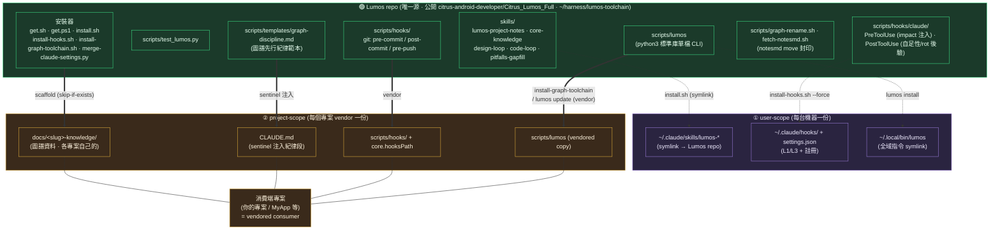
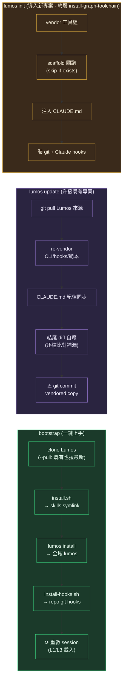
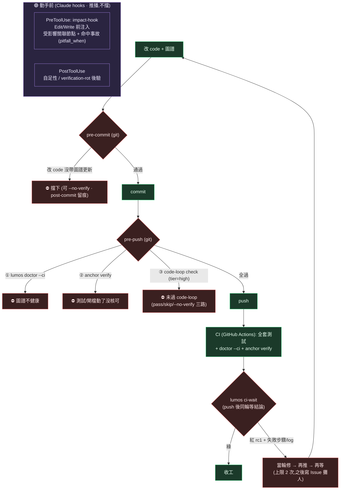

# Lumos 架構圖

> 「圖譜即合約」工具組的**唯一源 → 分發 → 消費端**模型。一張圖看懂:什麼東西住在哪、用哪個指令裝到哪、為什麼非這樣分不可。

## 1. 全景:唯一源 → 兩種 scope → 消費端

**為什麼分兩種 scope**:CI 只 checkout 專案 repo(要能跑 `scripts/lumos doctor`)、git hook 是 per-repo —— 所以 CLI/hooks **必須 vendor 進各專案**。skills 是純方法論文件,user-scope symlink 共用一份就好,不必 vendor(否則各專案副本會漂移)。

## 2. 安裝 / 生命週期指令做了什麼

## 3. CLI 子命令家族 (61 個頂層命令)

```mermaid
flowchart TB
    ROOT["lumos &lt;cmd&gt;<br/>(python3 標準庫 · 零依賴 · 61 個頂層命令)"]

    ROOT --> READ["讀取 / 導航"]
    ROOT --> HEALTH["巡檢 / 治理"]
    ROOT --> WRITE["寫入"]
    ROOT --> GUARD["合約守衛 (guard*)"]
    ROOT --> LOOP["對抗審計 loop"]
    ROOT --> INTEG["完整性 / 影響"]
    ROOT --> SARIF["社群 linter 橋"]
    ROOT --> CI["CI 回流觀測"]
    ROOT --> LIFE["安裝 / 生命週期"]

    READ --> R["context · show · contracts · search<br/>links · backlinks · map · export<br/>decisions · stale · recent · stats · drift-history"]
    HEALTH --> H["doctor · lint · lint-watch · lint-check<br/>self-audit · sync-verified-by · gov<br/>spec-trace · signoff · rel-cascade · test-layers"]
    CI --> C["ci-wait · ci-status<br/>(觀測非強制:擋不了 push/merge)"]
    WRITE --> W["set · append · remove · new · archive<br/>decision-add · decision-supersede · decision-reindex"]
    GUARD --> G["guard {list · scaffold · bind · audit · trace}<br/>(★INVARIANT★→[test:]→[audit:] 綁定鏈)"]
    LOOP --> LP["pitfalls (--diff tier) · code-loop {pass/skip/check}<br/>canary {record · second} · loop {status·next·compress·verify-progress·capture-counts}<br/>fold-check · refcheck"]
    INTEG --> I["anchor {verify · approve}<br/>impact (影響半徑 + 事故觸發)<br/>cochange · testmap {build · affected}"]
    SARIF --> ST["sqlfluff-sarif · stylelint-sarif<br/>compose-metrics · lint-check"]
    LIFE --> L["install · uninstall · update<br/>bootstrap · init · deinit · teardown"]

    classDef root fill:#1b3a2a,stroke:#3ddc84,color:#e8fff0
    classDef cat fill:#2a3142,stroke:#5a9bd6,color:#e0f0ff
    classDef leaf fill:#222,stroke:#666,color:#ddd
    class ROOT root
    class READ,HEALTH,WRITE,GUARD,LOOP,INTEG,SARIF,CI,LIFE cat
    class R,H,W,G,LP,I,ST,C,L leaf
```

> `guard`/`anchor`/`canary`/`loop`/`code-loop` 各帶子命令(如 `anchor verify`);上面 53 是頂層命令數,權威清單以 `lumos --help` 為準(**分類小計刻意不寫**:只有總數有機械守衛,寫了沒守的數字就是新漂移面)。

## 4. 強制力管線 (圖譜不腐爛的機制)

由「動手前推播 → commit 把關 → push 硬閘 → CI → **回流當輪修**」五段;訊號主動推到眼前(impact),硬閘擋在提交與推送點,CI 結論由 `lumos ci-wait` 拉回同一輪(需專案宣告 `.lumos/config.json` 的 `ci` 區塊才啟用;未宣告=此段不存在)。

> ⚠ **第五段是觀測不是強制**(2026-07-29 外審正名):`ci-wait` 只把雲端結論拉回來給人/agent 當輪修,**擋不了 push 也擋不了 merge**;gh 缺席、config 壞損、逾時、無 run 一律 fail-open rc0。要「紅燈進不了 main」得在 GitHub 開 branch protection required check——那是本工具**不碰**的設定面。前四段才是硬閘。

> **地板不是 oracle**:PreToolUse 是推播(可被無視)、git 閘可 `--no-verify` 繞(自負、留痕)。守得掉「忘了/隨手漏」,守不掉「刻意繞+不誠實」——那留給人。
