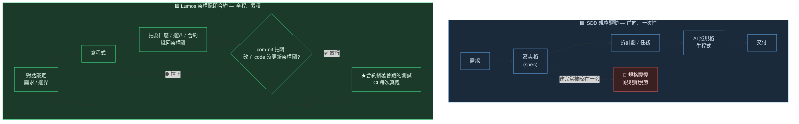

# SDD 規格驅動 vs Lumos 架構圖即合約

> 一句話:**SDD 把「要蓋什麼」講在開工前;Lumos 把「為什麼這樣蓋、哪裡不能拆」一路留下來,而且不准你偷偷拆。**

## 流程對比(這是 mermaid 最能表現的部分)

**看圖就懂的差別**:
- SDD 是**一條直線**:需求 → 規格 → 程式 → 交付。規格是「開工前的藍圖」,蓋完它的任務就結束了,容易被晾著、跟程式越差越遠。
- Lumos 是**一個回圈**:寫程式 → 把「為什麼」織回架構圖 → commit 時若沒織就擋你 → 合約還綁著測試每次 CI 真跑 → 下一輪繼續。它不是藍圖,是**全程跟著程式一起長大的記憶與合約**。

## 對照表(哲學差異,表格比圖清楚)

| | 🟦 SDD 規格驅動 | 🟩 Lumos 架構圖即合約 |
|---|---|---|
| **時機** | 動工**前**寫規格 | 每次迭代**當下**織回架構圖 |
| **方向** | 前向:規格 → 程式(單向) | 雙向:程式 ↔ 架構圖(改一邊逼你改另一邊) |
| **主角是什麼** | 規格 = 「**要做什麼**」 | 架構圖 = 「**為什麼這樣 / 邊界 / 合約 / 驗過沒**」 |
| **程式的角色** | 規格的產出物 | 「現在長這樣」的快照 |
| **壽命** | 常隨交付過期、被晾在一旁 | 持續被 commit / CI 強制,不准腐爛 |
| **靠什麼維持** | 靠人記得回去改規格 | commit 擋「改 code 沒更新架構圖」+ 合約綁測試真跑 |
| **解決的痛** | 開工前「需求講不清」 | 開工後「為什麼這樣」流失、合約被默默破壞 |

## 重點:兩者不打架

它們其實站在**不同時間點**:

- **SDD** 偏「**進場前**把需求對齊」——回答「我們到底要蓋什麼」。
- **Lumos** 偏「**全程**守住理解與合約」——回答「為什麼蓋成這樣、哪裡動了會出事」。

完全可以**同時用**:用 SDD 的精神把需求講清楚再動工,用 Lumos 把動工後累積的「為什麼 + 合約」一路釘住、不讓它隨時間流失。Lumos 補的正是「規格寫完之後,知識怎麼不腐爛」這一段。

## 進一步:Lumos 已經把 SDD 的前向階段收編了

上面「兩者並存」是保守講法。實際上 Lumos 不只跟 SDD 站在不同時間點——它**把 SDD 的規格吃進架構圖、還把它那條容易斷掉的迴路關起來**:

- **spec 進架構圖,不再被晾著。** 任何設計 / 計劃(不論來源:brainstorming、writing-plans、OpenSpec、其他 spec-driven 工具)一律寫成 lumos 計劃節點(`Projects/X_計劃`,`type: project`),不散落在 `docs/specs/`、`openspec/` 等 repo 路徑。左圖警告的「規格慢慢跟現實脫節」——因為規格從一開始就住在受同一套強制力管的架構圖裡,這個破口被堵住。
- **spec 進實作前先過對抗審計。** `design-loop`(canary 護的審計 loop)在寫 code 之前先審設計:植入瑕疵驗審計員醒著、辯方殺假陽性、證據閘收斂才准落地。SDD 的「規格」在這裡從一份文件,升級成一個**過了閘才放行的東西**。
- **意圖鏈不准斷。** 落地的 Verification 用 `plan_refs` 回指計劃節點,`doctor` Check 4 把關「計劃結案後有沒有對應的落地驗證」。規格 → 實作 → 驗證這條線被機械釘住,不靠人記得。

## 底層那條線:人管需求,機器守邊界 + 實作

把 SDD 和 Lumos 疊起來看,真正的分工線不在「規格 vs 架構圖」,在**人與機器的比較優勢**:

- **人負責決定「什麼該為真」**——釐清需求、確認需求,並且**對著一個會動的世界持續重新確認**一條已確認的需求還成不成立(尤其那些 code 一直沒動、沒有東西替它敲鐘的需求)。這是無界的判斷,無法固化,也是人**下不了班**的那部分。
- **機器負責「讓它為真、並持續保持為真」**——實作,以及守住邊界(合約綁測試真跑、改 code 逼更新架構圖、不可逆動作先寫回退、tier=high 進 push 前過對抗代碼審)。這些是有界、重複、易忘的事,正該機械化掉。

SDD 把「什麼該為真」講在開工前;Lumos 把「為什麼這樣、哪裡不能拆」一路守到底,並把人從機械性的守衛工作裡解放出來,只留下**非人不可**的那格判斷。

> **誠實天花板**:機器守的是*形式*(測試存在、回退有寫、乾淨 agent 審過、對抗 loop 收斂),不是 *validation*(這條規則今天還符不符合真實業務)。每一道閘都可被 `--no-verify` 繞、每個「獨立審計」仍是同一個人 prompt 的 agent。它守得掉「忘了 / 隨手漏」,守不掉「刻意繞 + 不誠實」。**push + 摩擦 + 地板,不是 oracle。**
