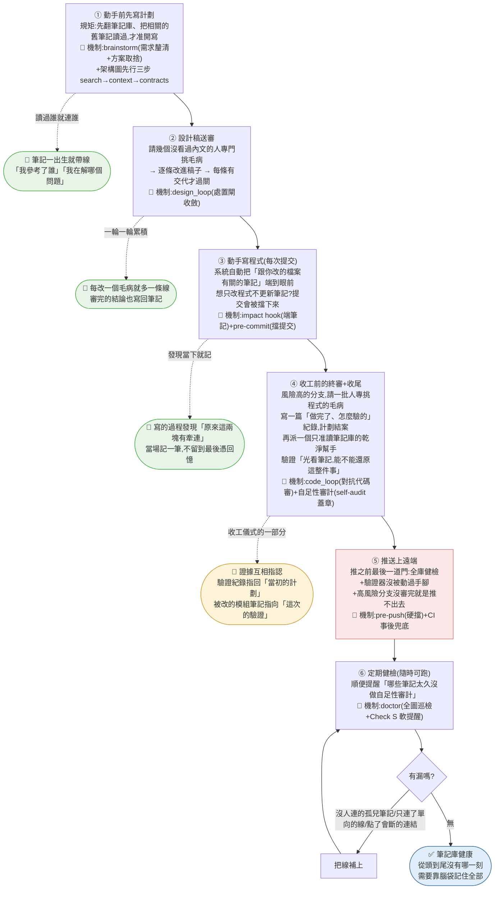

# 開發工作流總覽(白話版)

> 用途:對外解說與新人導覽的一張圖。每步的白話描述+對應機制名;規格細節在各機制自己的節點,本圖刻意不展開。

## 機制對應一句話版

| 步驟 | 機制 | 管什麼 |
|---|---|---|
| ① | brainstorm+架構圖先行 | 想清楚再動筆 |
| ② | design_loop | 設計稿別帶病進實作 |
| ③ | impact hook+pre-commit | 每次提交都同步筆記 |
| ④ | code_loop+自足性審計 | 合併前有人對抗式挑過毛病;筆記本身能自證 |
| ⑤ | pre-push+CI | 沒過關的東西物理上推不出去 |
| ⑥ | doctor | 定期抓漏、補鏈 |

## 已知坑(自足性審計被跳過)

「不允許子代理,跳過自審」的根因不是設定被關,而是該 session 在**子會談環境**跑:從 Claude 內開出的終端會繼承 `CLAUDE_CODE_CHILD_SESSION`,其中啟動的 claude 被視為子代理、不得再生子代理。判法:`env | grep CHILD_SESSION` 有值即中;解法:換一個非 Claude 衍生的終端。漏掉的自審由 doctor Check S 提醒,回正常 session 補蓋章。
